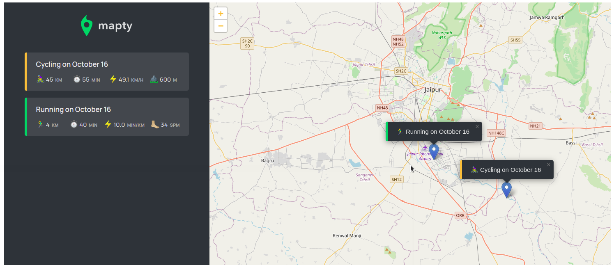

# Map App



> This is an application which displays your workout details and location on the map based on the workout form you fill and the location you choose.

## Features

    * Map is displayed where you can choose the location by clicking on the map
    * After clicking on the map a workout form is displayed which you can fill based on the workout you want
    * Submit the form which will result in rendering the workout details and a marker on the map at the location you selected.

## Tech

| tech                  | description                                                                                |
| --------------------- | ------------------------------------------------------------------------------------------ |
| html, css, javascript | for a dynamic, functional and beautiful webpage                                            |
| leaflet library       | third party library to display and implement the functionality of map                      |
| browser local storage | to save the data and to persist the workout and location data through mutiple page reloads |

---

## Project Setup

- first install node.js and npm in your local machine
- npm is tied closely to Node.js and it is recommended that they be installed together. Most distros even list them as dependencies of one another
- to install npm on ubuntu you can use commands like

```bash
$ sudo apt install npm
OR
$ sudo apt install npm nodejs
```

- you can find appropriate commands/ways to install nodejs and npm on your system.
- then use commands to see the version of npm and nodejs like

```bash
$ npm -v
$ node -v
```

- if the version shows that means npm and nodejs is installed on your system.
- then install live-server package which is in npm with the command:

```bash
$ npm install live-server
```

- then fork and clone the project's repository
- then on your machine just run live-server command in the project's folder

```bash
$ live-server
```

- this will build a development server which you can use to run the project locally.
- then go to the server url and see the project running.

## Contribution

```bash
  * feel free to contribute to this project.
  * just use the code and run the application and if there is any mistake or a thing which i would have done better, just suggest to me.
```
